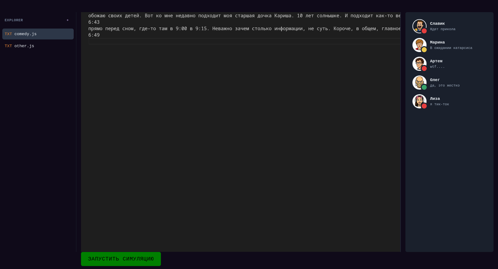

прошу прощения за javascript. конечно трушно было бы это все написать на плюсах, но у меня нету столько времени

#### Находим слабые места в тексте

Короче пока что реализован следующий функционал.
```
"hf.co/speakleash/Bielik-11B-v3.0-Instruct-GGUF:Q4_K_M"
```

вот эта моделька неплохо справляется с тем, чтобы находить слабые места в тексте.

Сам json выглядит вот так
```json
{
    text: ".....",
    cure: ".....",
    value: 0
}

```

#### Интерфейс
> пока что реализована функция запуска симуляции в тексте. есть 5 базовых персонажей, к которым прописаны промпты и они оценивают текст, который был написан - смешно или не смешно.

логичное продолжение этой фичи - добавить возможность составлять своих персонажей



---------------
еще немного грустно что на моем cpu такая симуляция длится около 15 минут для вот такого маленького текста. поэтому дальше я хочу перейти на облачные решения и запускать это все в несколько потоков.

---------------------

# React + Vite

This template provides a minimal setup to get React working in Vite with HMR and some ESLint rules.

Currently, two official plugins are available:

- [@vitejs/plugin-react](https://github.com/vitejs/vite-plugin-react/blob/main/packages/plugin-react) uses [Babel](https://babeljs.io/) (or [oxc](https://oxc.rs) when used in [rolldown-vite](https://vite.dev/guide/rolldown)) for Fast Refresh
- [@vitejs/plugin-react-swc](https://github.com/vitejs/vite-plugin-react/blob/main/packages/plugin-react-swc) uses [SWC](https://swc.rs/) for Fast Refresh

## React Compiler

The React Compiler is not enabled on this template because of its impact on dev & build performances. To add it, see [this documentation](https://react.dev/learn/react-compiler/installation).

## Expanding the ESLint configuration

If you are developing a production application, we recommend using TypeScript with type-aware lint rules enabled. Check out the [TS template](https://github.com/vitejs/vite/tree/main/packages/create-vite/template-react-ts) for information on how to integrate TypeScript and [`typescript-eslint`](https://typescript-eslint.io) in your project.

